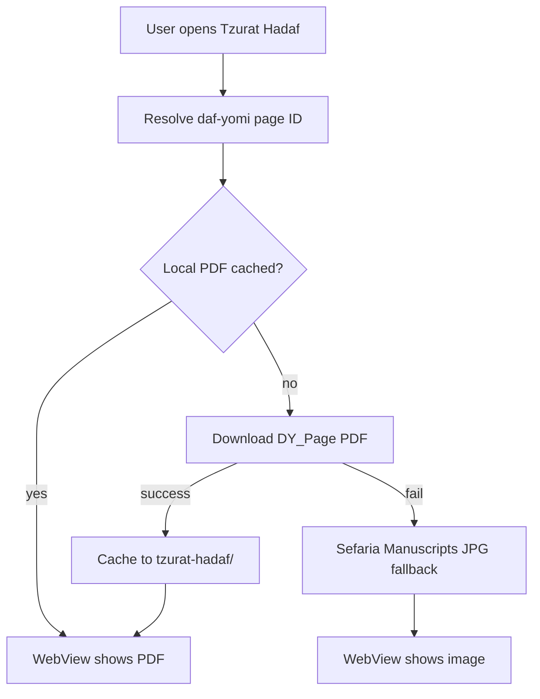

# Switch Tzurat Hadaf to daf-yomi.com PDFs

## Overview

Switch צורת הדף to load Vilna page PDFs from daf-yomi.com (e.g. `DY_Page/4654.pdf` for Chullin 25a), keeping Sefaria Manuscripts as a fallback when the PDF is unavailable.

## Context

The app currently loads צורת הדף via the **Sefaria Manuscripts API** in [`src/services/sefariaManuscripts.ts`](../src/services/sefariaManuscripts.ts), caches JPGs locally, and displays them in a WebView `` in [`src/components/TzuratHadaf/TzuratHadafViewer.tsx`](../src/components/TzuratHadaf/TzuratHadafViewer.tsx).

The daf-yomi.com PDF URL uses the **same numeric page ID** as their portal:

- Portal: `https://www.daf-yomi.com/DafYomi_Page.aspx?id=4654&vt=1` → **Chullin 25a**
- PDF: `https://daf-yomi.com/Data/UploadedFiles/DY_Page/4654.pdf`

Verified mapping formula (per masechet):

```ts
pageId = masechetStartId + (dafNum - 2) * 2 + (amud === "b" ? 1 : 0);
```

Sample anchors:

| Location    | Page ID |
| ----------- | ------- |
| Berachot 2a | 1       |
| Shabbat 2a  | 126     |
| Gitin 2a    | 2451    |
| Chullin 2a  | 4608    |
| Chullin 25a | 4654    |

**Important:** daf-yomi.com page counts do not exactly match [`src/data/shas.ts`](../src/data/shas.ts) `pages` values (e.g. Berachot has 125 amudim on daf-yomi.com, not 126). A static **per-masechet start-ID table** is required rather than deriving IDs from `shas.ts` alone.



## Implementation plan

### 1. Add daf-yomi page ID mapping

Create [`src/utils/dafYomiPageId.ts`](../src/utils/dafYomiPageId.ts):

- `buildDafYomiPdfUrl(pageId: number): string` → `https://daf-yomi.com/Data/UploadedFiles/DY_Page/${pageId}.pdf`
- `resolveDafYomiPageId(masechetEn, dafNum, amud): number | null` using a static `MASECHET_START_IDS` array aligned with [`SHAS_MASECHTOT`](../src/data/shas.ts) order (40 entries)
- Generate the start-ID table once during implementation by sampling daf-yomi.com (confirmed anchors above + one fetch per masechet for `דף ב ע"א`, or parse their sitemap). Store result in [`src/data/dafYomiPageStarts.ts`](../src/data/dafYomiPageStarts.ts) to keep the utility small.

### 2. Add daf-yomi PDF fetch/cache service

Create [`src/services/dafYomiPages.ts`](../src/services/dafYomiPages.ts) (mirrors existing cache patterns in `sefariaManuscripts.ts`):

- Cache dir: `tzurat-hadaf/` (reuse existing folder; new files use `.pdf` extension keyed by tref)
- `fetchDafYomiPage(masechetEn, dafNum, amud)`:
  1. Resolve page ID → build PDF URL
  2. Return cached local URI if present (memory + disk)
  3. `HEAD` or `GET` the PDF; on success, `FileSystem.downloadAsync` to cache
  4. Return `{ source: 'pdf', uri }` or `null` on failure

### 3. Orchestrate primary + fallback in screen layer

Update [`src/screens/TzuratHadafScreen.tsx`](../src/screens/TzuratHadafScreen.tsx) `loadPage`:

1. Try `fetchDafYomiPage(...)` first
2. If null/error, call existing `fetchVilnaManuscriptPage(...)` from Sefaria
3. Pass a discriminated prop to the viewer, e.g. `{ kind: 'pdf' | 'image', uri: string }`

Keep existing cache peek/resolve calls working for both sources (keyed by the same tref).

### 4. Update viewer for PDF + image

Update [`src/components/TzuratHadaf/TzuratHadafViewer.tsx`](../src/components/TzuratHadaf/TzuratHadafViewer.tsx):

- Accept `page: { kind: 'pdf' | 'image'; uri: string } | null` instead of bare `imageUrl`
- **PDF path:** WebView `source={{ uri }}` for remote/local PDF (with existing `allowFileAccess` flags). Drop the `` HTML wrapper for PDFs.
- **Image path (Sefaria fallback):** keep current pinch-to-zoom HTML `` behavior unchanged
- Loading/error UI stays the same; Sefaria text button remains as secondary option

If direct PDF rendering is unreliable on a target device during testing, fallback within the PDF path to an embedded viewer HTML (Google gview or pdf.js) — only if needed.

### 5. Copy updates

- [`src/components/Settings/GuideModal.tsx`](../src/components/Settings/GuideModal.tsx): change source attribution from "Sefaria Manuscripts" to "daf-yomi.com (with Sefaria fallback)"
- [`README.md`](../README.md): update Tzurat Hadaf tech description accordingly

## Files touched

| File | Change |
| --- | --- |
| `src/data/dafYomiPageStarts.ts` | **New** — 40 masechet start IDs |
| `src/utils/dafYomiPageId.ts` | **New** — ID + URL helpers |
| `src/services/dafYomiPages.ts` | **New** — PDF fetch/cache |
| `src/screens/TzuratHadafScreen.tsx` | Primary daf-yomi + Sefaria fallback orchestration |
| `src/components/TzuratHadaf/TzuratHadafViewer.tsx` | PDF + image rendering |
| `src/services/sefariaManuscripts.ts` | Keep as-is (fallback only) |
| `GuideModal.tsx`, `README.md` | Source attribution |

## Test plan

- Open today's daf (Chullin 25a) → loads `4654.pdf` correctly
- Navigate prev/next amud and prev/next daf → correct PDFs load
- Turn off network on an uncached page → shows Hebrew offline error
- Load a page once, go offline, reopen → serves from local PDF cache
- Simulate daf-yomi.com failure (bad ID or airplane mode before first fetch) → Sefaria JPG fallback appears
- Confirm Sefaria "פתח בספריא" button still opens text in browser

## Todos

- [ ] Create dafYomiPageStarts.ts + dafYomiPageId.ts with verified per-masechet start IDs
- [ ] Add dafYomiPages.ts service for PDF URL resolution, download, and local cache
- [ ] Update TzuratHadafScreen to try daf-yomi.com first, Sefaria second
- [ ] Update TzuratHadafViewer to render PDF or image based on source kind
- [ ] Update GuideModal and README source attribution
